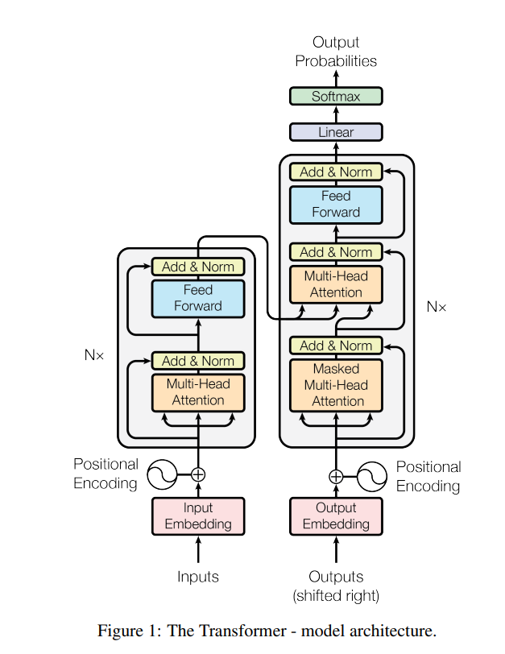
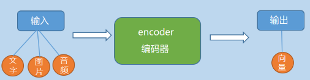
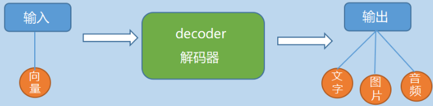

# Attention is all you need - paper笔记

## 0 参考链接

[论文链接](https://arxiv.org/pdf/1706.03762)

[参考解读](https://blog.csdn.net/weixin_43334693/article/details/130208816)

## 1 整体架构及拆解

上图就是transformer的整体架构，左边的部分是encoder，右边的部分是decoder。

### 1.1 encoder-decoder

encoder部分概括来说就是将输入序列压缩（编码或特征提取）成指定长度的向量的过程，将现实问题转化为了数学问题。

而decoder则可以理解成encoder的逆运算，将输入的向量转换为目标类型输出（取决于任务是什么，如果是翻译就是输出译文）的过程，将数学问题转化为了现实问题。

