# 高级数据结构与算法分析
## 期中前内容梳理

*参考资料：毛宇尘老师2023智云、ads课程组ppt、王灿老师难点分析，期中复习可以直接看这部分*

---

## 0 整体内容梳理

截至期中（王灿老师班），本课程内容可以分为以下几块：

1. **Trees:**
   - AVL Tree
   - Splay Tree
   - B+ Tree
   - Red-black Tree
2. **Heaps:**
   - Leftist Heap
   - Skew Heap
   - Binomial Queue
3. **Inverted File Index**
4. **算法分析：**
   - Backtracking
   - Divide and Conquer
   - Dynamic Programming
5. **Amortized Analysis**

其中，根据历年卷，树和堆在选择和程序填空题里面出现频率比较高，还是需要明白每一个操作是怎么进行的。

一般难点会放在均摊分析和一些比较模糊的点，不过模糊的话就从数据结构的性质入手解题，不要太较真。

## 1 Trees

### 1.1 AVL Tree

#### 1.1.1 定义

balanced binary search tree

balance: 对于树的任意节点$u$，其左子树的高度$h_L$和右子树的高度$h_R$满足条件：**$|h_L-h_R|≤1$**

#### 1.1.2 性质

LEMMA: A balanced binary tree with $N$ nodes must have a height of $O(logN)$

证明思路：固定高度，写出最少节点情况的递推式，类斐波那契递推。

#### 1.1.3 操作与维护

一边操作一边维护平衡的性质，树的高度和维护代价都是$O(logN)$数量级的。

首先，维护都是基于**旋转**这个操作的：

- left rotation & right rotation 具体过程

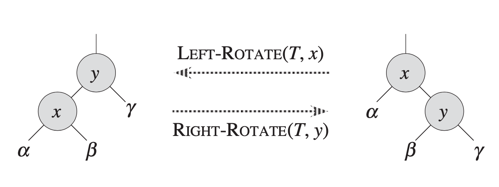

- 一次只需改3个指针，$O(1)$复杂度

接下来我们考虑**插入**操作：

- 根据插入后的不平衡情况我们分为4个case，其中另外两种情况直接对称类比即可。主要还是要找到失衡的那个节点然后再去作LL/LR等rotation。
- RR case: 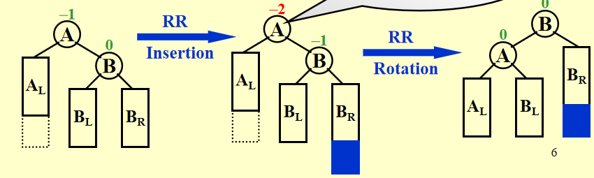

- LR case: 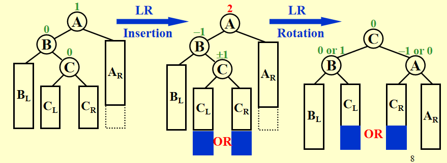

而对于**删除**情况，我们依然找到以失衡节点为root的子树并将情况和插入的四个case对应，使用rotation解决，不过在修复过程中可能会导致上面的节点不平衡，因此需要不断从下到上修复。

历年题纠错：

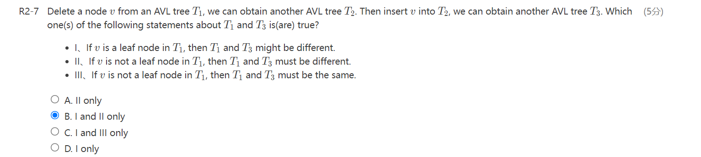 

这道题正确答案应该是D，解题的关键在于有些AVL Tree是有唯一解的，例如我们顺序插入1、2、3三个节点然后删除根节点再插入，两次的AVL Tree是一样的。

### 1.2 Splay Tree

#### 1.2.1 定义

本质还是BST，不过在操作过程中添加了**Splay**的操作：

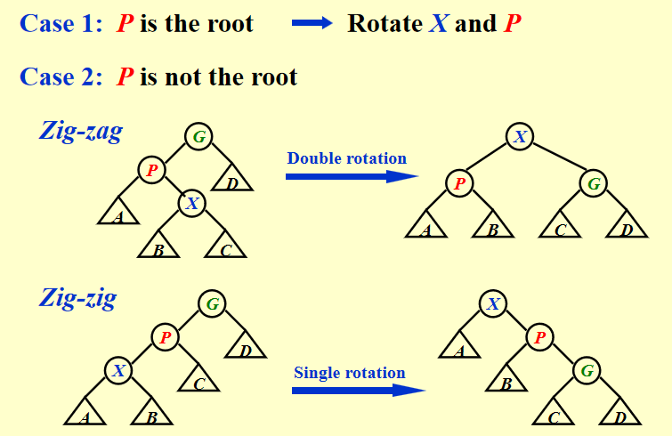 

值得注意的是这里的Single rotation是**一步到位**的，不能分成两次慢慢把`X`转上去，会出问题。

具体操作上先定主干再定每颗子树位置会清晰一些。

这一操作使得splay tree的查找、插入和删除的均摊费用均为**$O(logN)$**（具体分析见Amortized Analysis）。

#### 1.2.2 操作

- **查找**：正常在BST中的查找，找到后splay那个被找到的节点
- **插入**：正常在BST中的插入，找到后splay那个被插入的节点
- **删除**：
  1. splay 要被删除的节点
  2. 如果节点只有一个子树，直接删除；如果有两个子树，删除这个节点后将左子树最大节点splay并作为root节点，合并右子树。

历年题纠错：
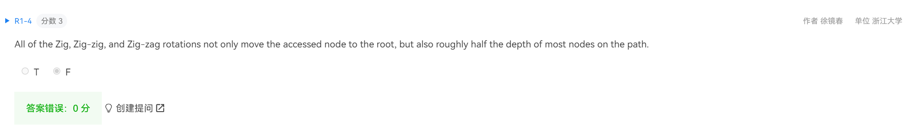

答案是T。好模糊的题，大致就是splay的目的就是优化路径结构吧，所以这个不能量化的表述从这个意义上来说确实是对的。

### 1.3 B+ Tree

#### 1.3.1 定义

- B+树的构造可以分成两部分：
  - 非叶子节点，是导航节点，$e_i$ = min element stored in leaves of $T_{v_{i+1}}$ 且 $e_i$ ＞ every element om leaves of $T_{v_i}$
  - 叶子节点存储数据，所有叶子节点是等深度的
- 根据B的值的不同，非叶子节点的孩子数量和叶子节点的element个数均有限制：
  - $\lceil{B/2}\rceil$ ≤ fanout of an internal node ≤ $B$，root的fanout的限制是[2,B]，root也可能没有children，这个时候就没有限制
  - $\lceil{B/2}\rceil$ ≤ # elements in a leaf ≤ $B$, if the leaf is the root, 1 ≤ #elements ≤ B

#### 1.3.2 性质

- 如果有$N$个data elements，空间复杂度为$4N$ - 可以使用1.3.1的限制条件拿最多节点数*节点最多元素数推
- 高度是$O(log_BN)$的
- 导航取值不会重复

#### 1.3.3 操作

三个操作的复杂度均为$O(logN)$

- 查找：和导航取值比较，比它或相等大则向右边的导航取值找，比它小则向左子树找
- 插入：先查找插入位置，然后处理可能的overflow（从下往上均分，直到parent无overflow）
- 删除：先查找删除节点，然后处理可能的underflow（找一个有大于等于 $\lceil{B/2}\rceil + 1$ children的sibling拿一个，都没有的话可以merge）
- 具体分析：
- 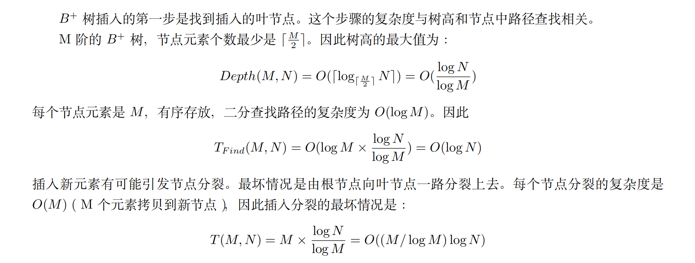 

### 1.4 Red-Black Tree

#### 1.4.1 定义

首先我们先要明确红黑树的定义是基于extended version的，在数bh的时候不能遗漏NIL

1. root、NIL和red node的children都是black
2. 对每个节点，其所有descending path上面的黑节点数量（不包括节点本身）是一样的，并且这个数量被定义为这个节点的bh

#### 1.4.2 性质

- 最长路的height不会超过最短路的两倍，且$h(T)≤2*bh(T)$
- 树高上限$2log_2(n+1)$ - 证明思路：把问题转化成$size(Tu)≥2^{bh(u)}-1$ for any $u$，用数学归纳法证明

#### 1.4.3 操作

都是$O(logN)$复杂度的，其中插入最多旋转2次，删除最多旋转3次

- 插入
  - 按照BST的插入方式插入并标红，如果插入节点的parent是红色的需要维护：
  - 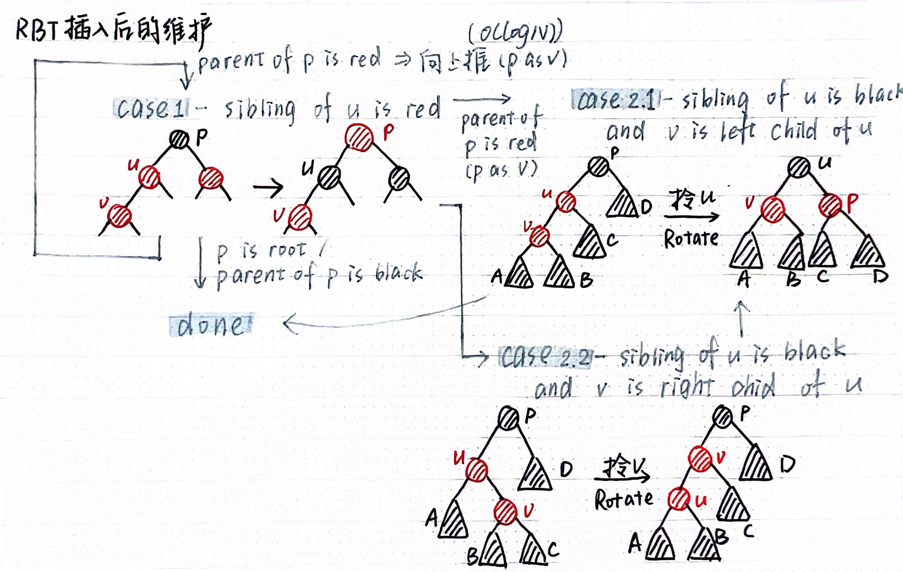
  - 更正：case1的p如果是root需要再把root标记成黑色再done
- 删除
  - 按照BST的删除方式删除，默认和左子树最大节点交换（也可能和右子树最小节点交换），并且只交换key不交换颜色。当被删除的节点为红色或者左孩子是红色时，直接删除即可，而当被删除节点有两个NIL，需要将其记为一个**double black**节点并进行维护（左右对称，这里以左孩子为double black为例）：
  - 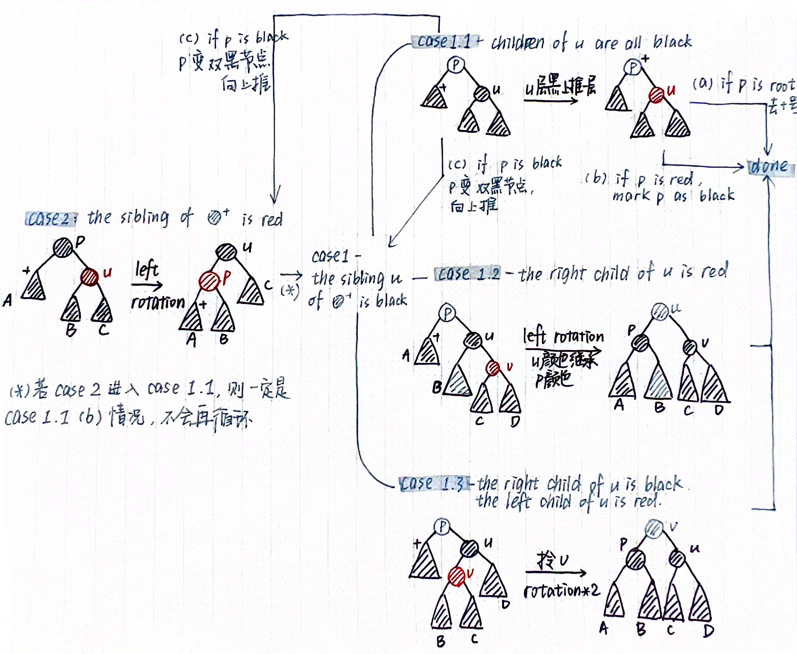
- 关于维护的过程个人理解就是：一层节点如果是平衡的红/黑（这也是对sibling分类讨论的意义），就考虑先将低层的性质解决并把问题向上推；如果非平衡就考虑通过旋转把问题平衡化。分情况讨论的过程中要注意红节点的孩子一定是黑的这一限制，可以带来一些剪枝。

```cpp
/* 之前老师在群里发了红黑树的口诀，但是个人觉得不太好用，不过还是放上来以作参考：
(1)兄弟红易兄弟黑，换色斜旋接着推; 
(2)侄黑父红换兄色，父侄全黑兄染红，上推; 
(3)近侄红来远侄黑，换色斜旋模样改; 
(4)远侄红来令其黑，父兄换色斜旋坠。 */
```

## 2 Heaps

### 2.1 Leftist Heap

#### 2.1.1 定义

1. 满足基本堆的性质（最大堆/最小堆，完全二叉树）
2. 具有**左倾（leftist）**性质 - 对于任意一个节点`u`，right descending path是`u`到`null`的最短路（并且长度记为`npl(u)`）之一

#### 2.1.2 性质

- 这个数据结构的目的是优化堆merge操作的复杂度 - $O(N) \to O(logN)$
- 对$N$个节点的左倾堆，right path最多有$log_2{(N+1)}$个节点 - 证明：转换为对于含$r$个节点的right path的左倾堆最少有$2^r-1$个节点，然后使用数学归纳法证明

#### 2.1.3 操作

以下提到的操作都是$O(logN)$复杂度的：

- **合并** - 采用递归实现，先将两个堆（最小堆）较小的根作为合并后新的堆的根，再将另一个堆和新的根的右子树合并，判断两个子树的`npl`，如果右子树大则两子树交换。每次合并完要更新新根的`npl`。
- **插入** - 合并原堆和要插入的node
- **DeleteMin** - 合并左右两子树
- **删除**
  - 挖出以要删除的节点`u`为根的子树`Tu`，把**修复**后的`H'`（`H - Tu`）和`Tu`的左右子树合并。
  - 关于修复：只有`u`的ancestors需要修复，所以从底向上访问`u`的ancestors：
    - 如果$u_{i-1}$是$u_i$的右孩子，直接更新$npl(u_i)$的值并继续向上访问
    - 如果$u_{i-1}$是$u_i$的左孩子，记$u_i$右孩子为$v$：
      - $npl(u_{i-1})≥npl(v)$，修复完成，break
      - $npl(u_{i-1})<npl(v)$，把$u_i$的左右孩子互换并更新$npl(u_i)$，继续向上访问
- **DecreaseKey** - 和删除几乎一样的操作，只不过不直接删除`u`而是在拆分出来的`Tu`里面decrease key再合并。

建堆参考pta上某道作业题的过程，利用queue实现，是$O(N)$复杂度的。

### 2.2 Skew Heap

- 合并操作与左倾堆类似，区别就是在合并完之后会**无条件交换**左右子树，并且如果遇到合并的两个子树其中一个为空子树会交换另外一个子树right path上**除最低层之外**所有节点的左右孩子，所以在斜堆这里是没有npl这个概念的。所以左右path的长度也是没有限制的，所以Leftist Heap相比之下会更加balanced。
- 插入和删除最小值都是通过合并实现的，而删除和DecreaseKey是不支持的。
- 以上所有可行操作均摊意义下$O(logN)$ - 具体分析见Amortized Analysis

### 2.3 Binomial Heap

#### 2.3.1 Binomial Tree

- 定义：递归定义的，$B_0$就是单个节点，而$B_k$则为$B_{k-1}$的根节点再在最右边接入一棵$B_{k-1}$子树
- 性质（对于$B_k$）：
  1. 节点数为$2^k$，高度为$k$
  2. 第$d$层节点数为$C(k, d) = \frac{k!}{d!(k-d)!}$ - 可以使用数学归纳法证明
  3. 有从$B_0$到$B_{k-1}$的$k$个子树

#### 2.3.2 定义

二项堆由数个满足堆性质的Binomial Tree构成（对每一个$k$，最多一个$B_k$），一般将节点数转换为**二进制**可以确定构成形式。

根据Binomial Tree的性质易推得高度是$O(logN)$级别的。

代码实现：通过left-child-next-sibling实现

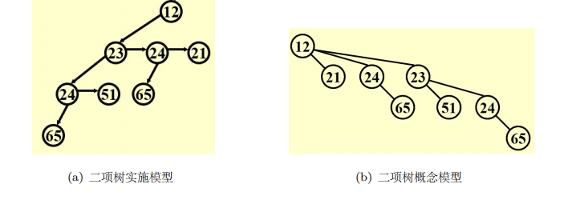 

有一个值得注意的点是合并后要按子树大小降序排列。

#### 2.3.3 操作

基本是对应二进制运算的，例如插入即+1，合并就是加法，DeleteMin就是减法（-1）

- **FindMin** - 遍历各树的根节点就可以找到，不过我们会维护一个指向最小根的指针，所以是$O(1)$的

- **插入** - 先把这个节点插入到$B_0$，如果有两个相同$k$的$B$就合并，直到所有$k$唯一 - $O(logN)$，平均时间复杂度是constant的
- **合并** - 按照$k$从$0$到$maxk$遍历，如果$B_k$多于1个则合并 - $O(logN)$
- **DeleteMin** - 找到包含最小节点的$B_k$，$Merge(H-B_k, B_k - root)$ - $O(logN)$
- **DecreaseKey** - 把这个节点在其所在堆不断向上换 - $O(logN)$
- **删除** - $DecreaseKey(x, -\infin)+DeleteMin$ - $O(logN)$
- **建堆** - 逐个插入即可 - $O(N)$（是worst case），具体分析见Amortized Analysis，这也说明了$N$个插入的平均时间复杂度为$O(1)$

## 3 Inverted File Index

```cpp
// 看了一下历年卷感觉主要考一些定义，不要搞混就可以
```

### 3.1 基本结构

 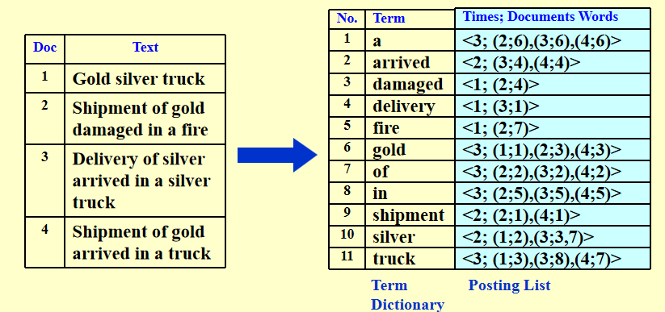

### 3.2 基本处理

- **Word Stemming** - 把一个词的不同变形处理为同一个词
- **Stop Words** - 对辨别文档没有作用的高频词，作停用处理

### 3.3 搜索方式

- **BST** - 支持范围查找
- **Hashing** - 快速

### 3.4 优化方式

#### 3.4.1 分布式

- **Term-partitioned index** - 根据单词首字母分类，查找效率高，但是容易造成单点故障，容灾能⼒差
- **Document-partitioned index** - 鲁棒性好

#### 3.4.2 动态索引

- **添加** - 先存到临时内存，再每隔⼏分钟存到main index
- **删除** - lazy deletion，直接标记指针⽆效

#### 3.4.3 压缩

去停⽤词把字符串连起来，使⽤指针记录每个单词开始的位置并利⽤差分减少数据的字符量

#### 3.4.4 筛选

词越低频对应权重越高，仅输出总权重最高的几个文档

### 3.5 评估方式

1. 索引建立速度
2. 查询速度
3. 支持查找类型
4. 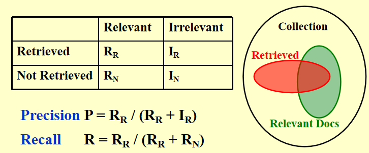 

## 4 算法分析

```c
// 这块的例题分析主要是我对于题目思路的理解，可能会非常意识流，完整分析见我的纸质笔记
// 期末补充：真的有点意识流，指我期末复习看不懂我期中写的整理的程度。建议是翻一下ppt/纸质笔记，知道每个问题是什么之后再看会清晰一点。
```

### 4.1 Backtracking

#### 4.1.1 基本思路

Backtracking = dfs + 剪枝

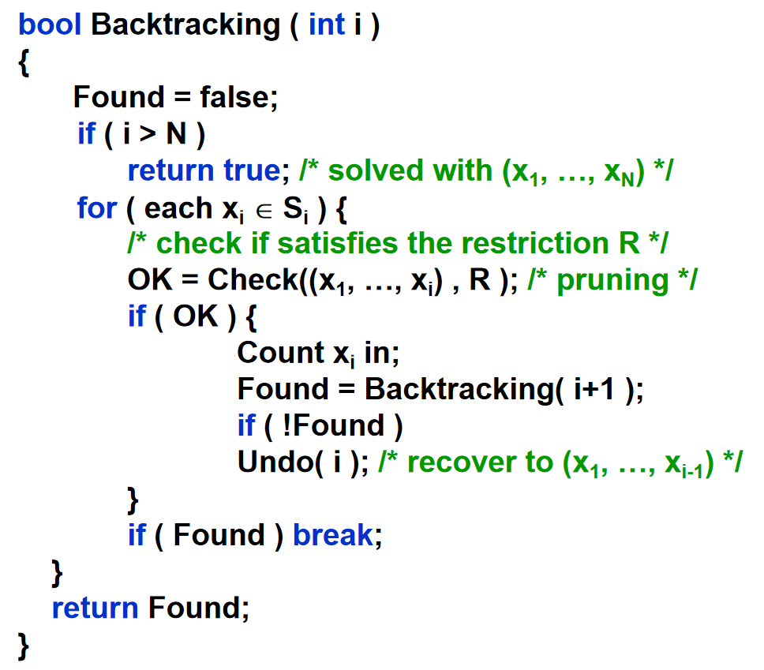

在面对具体题目的时候，我们需要搞清楚的无非4个问题：

1. 如何遍历 - `i`是什么，$S_i$是什么
2. OK function是什么
3. 如何count in
4. 如何undo

#### 4.1.2 例题分析 - 对于每一个问题可以清晰说出4.1.1的4个问题即可

1. **N Queens Problem**

比较基本的遍历，剪枝就是在已经会attack的地方不往下走了

2. **Turnpike Problem**

问题就是根据距离集复原点集，主要抓住可能性最少的点（max距离）入手去作分类讨论和剪枝

3. **三子棋游戏**

不同于前两个问题，这个问题只有走完才能知道win/lose，所以我们用$f(p) = W_{you} - W_{oppo}$来评估每个情况的胜率，并在我方和对方轮次分别取max和min，而max和min的取值则诞生了两个剪枝方式：

- $\alpha$ pruning - 父节点要取max，子节点取min 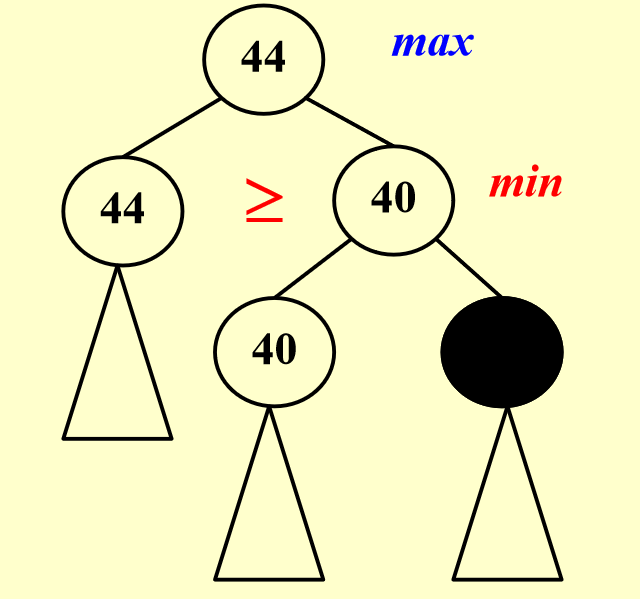

- $\beta$ pruning - 父节点要取min，子节点取max 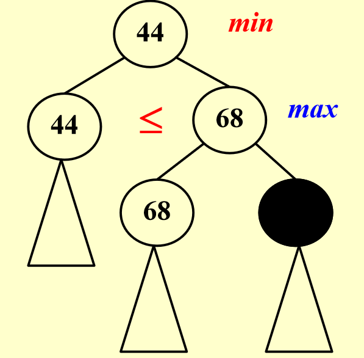

关于$\alpha$/$\beta$ pruning的历年题会问，哪个是第一个被剪枝的节点，这个时候我们要注意剪枝不止是一层的，有可能上面的grandparent也会带来剪枝，一定要从root开始分析：

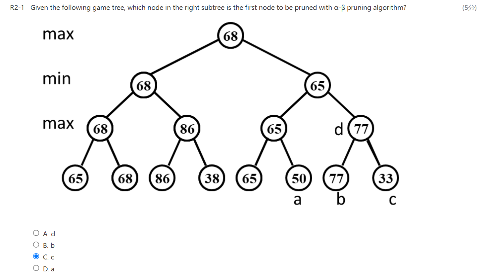 

这道题答案是d，一定要从`68`这个节点开始看，只分析右子树就会选错。

### 4.2 Divide and Conquer

#### 4.2.1 基本思路

1. divide - 分成子问题
2. conquer - 解子问题
3. combine - 把子解合并成总解

#### 4.2.2 例题分析

1. **Counting Inversion**

首先由分治法我们自然而然想到把问题分成left、right和split三块，然后left和right可以递归解决；

在处理split的时候，我们发现归并排序可以让每一次split的问题$O(N)$解决，所以一边归并一边数split逆序对。

2. **Closest Pair Problem**

如果说上一题的核心思想是寻找类似算法、磨刀不误砍柴工，那么这道题的核心思想就是利用前面的left和right两种情况对spilt情况进行剪枝优化。

还是一样将问题分成left、right和split三块，然后left和right可以递归解决；

我们利用前两种情况得到的最小值约束split情况点可能的范围，并且指定纵坐标范围内的点个数有限（≤8个），于是我们先对范围内的点按纵坐标排序，对于每个点我们只需要考虑下面7个点即可，单次遍历是$O(1)$复杂度的。

#### 4.2.3 主定理（Master Theory）

在这里我们要解决的问题就是，在已知$T(N)$递推式的情况下，如何求解$T(N)$

对于简单问题，我们可以画出recursion tree然后通过累加每一层、等比数列求和得到；

而对于比较复杂的问题，我们根据recursion tree的基本原理总结出了一般规律，也就是主定理：（考试的时候基本上直接用即可）

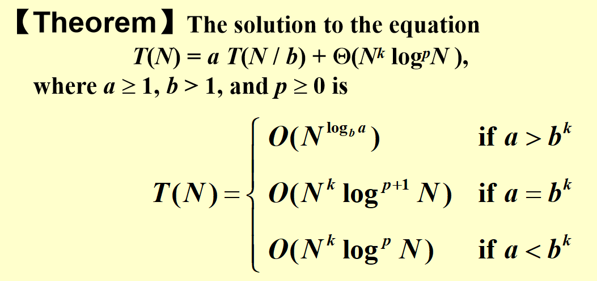

```c
// 下面两个是等价的，理论上记一个就可以。但是历年卷有直接考这两个原始形式的，建议都推一遍或者背下来。
// 也可以分成三种情况：root决定、leaves决定和整体决定
```

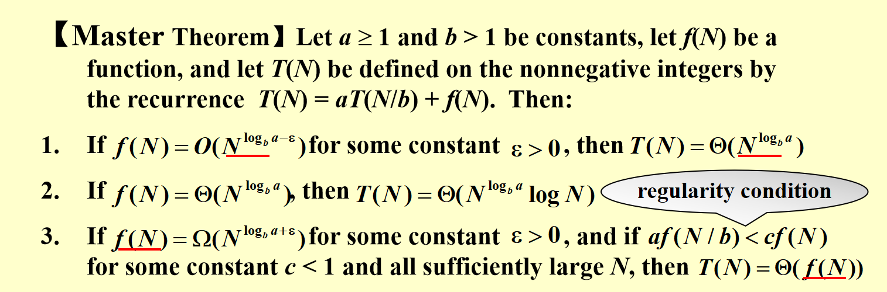 

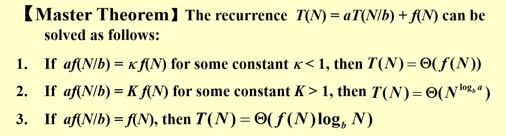 

我们可以看到，这些主定理的递推式都是$aT(N/b)$的递推形式的，那么我们怎么处理不是这样的形式的递推式呢？

看下面这个例子，换元即可（其实对具体问题，画recursion tree也是可解的，要注意树的层数问题即可）。

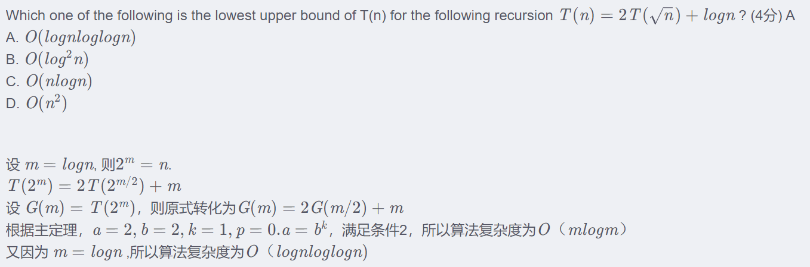 

历年题纠错：

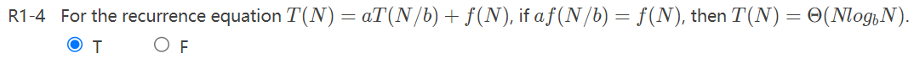 

答案应该是F。别乱举特殊情况就好，画个recursion tree算一下应该是$f(N)\log_bN$。

### 4.3 Dynamic Programming

#### 4.3.1 基本思路

1. defining **subproblem** - 定义子问题
2. finding recurrence - 由子问题找到递归解法
3. computing the optimal value for (sub)problems - 计算子问题最优解
4. reconstructing the optimal solution - 根据最优解（值）重构寻找解法

其实我对动态规划的理解就是递归的逆运算，因为类似斐波那契之类的多项递归会造成多次重复运算带来很高的复杂度，从底部到$n$的逆运算就会优化这个问题。

#### 4.3.2 例题分析

1. **Weighted Independent Set on a Path**

我们先把问题聚焦到单个点上，对这个点属不属于最优解集合分类讨论进而解出递归的式子、定义子问题`c[i]`，最后使用`c[i]`构建最优解的具体内容。

2. **Knapsack Problem**

和上个问题一样，我们还是把问题先找一个小切口也就是这个物品属不属于最优解集。但是这次我们讨论的问题除了物品个数之外还有不同的`capacity`作为限制条件，所以我们采用二维数组。

对于有两个限制条件的问题都可以效仿背包问题的子问题：

define `v[i][c]` be the maximum total value of a subset of **first `i` items** with total weight **at most `c`**.

在解决这个问题的过程中，我们应该额外注意两种情况是否都合法——下标是否越界等，做好极端情况和初始情况的定义。

其中，时间复杂度是$O(nC)$的，空间复杂度是$O(n+C)$的。

3. **Optimal BST**

对树问题的切入口，我们自然想到将其分成root、左子树和右子树，因为子树是可以递推的。取搜索时间最短的root就是我们的子问题。

而在具体计算的过程中我们还讨论了怎么样的递推式是可解的这一问题，我认为可以通过建立ij直角坐标系画图解决。

其中，求解的时间复杂度在对r剪枝后是$O(n^2)$，复原过程时间复杂度剪枝后$O(n)$。

4. **矩阵乘法**

我们从单次乘法运算入手，分类讨论的方式就是添括号的位置，取操作次数为min的括号位置就是子问题。

5. **最短路问题**

对于有负边无负环的情况可以使用动态规划算最短路。

个人对这道题的理解是：当图中有了负边的时候，边的数量增加不再和`cost`增加是等价关系，因而`dijkstra's algorithm`失效，这个时候我们类比背包问题的思路，将边的数量也作为限制条件之一，建立二维数组，固定边数去讨论这个问题。

因此也就有了这个子问题：

let `c[v][i]` be cost of the shortest path from `s` to `v` with **at most** `i` edges (`c[v][i]` = $+\infin$ if no such path exists).

因为在递推的过程中我们会强调**最优**这个概念，因此我们看到的很多下标限制都是至多或者至少这种单边限制条件，然后我们的递推式也可以根据这个等号是否取到分类讨论。

时间复杂度是$O(|V||E|)$的。

这里还有一个LEMMA：

`G` has no negative cycle if and only if `c[v][n-1] == c[v][n]` for any `v` ∈ `V`

6. **All-pair Shortest Path (APSP)**

目的是求每个点对间最短路

- 如果没有负边用`dijkstra's algorithm`即可，时间复杂度$=|V|*\text{Dijkstra's} = O({|V|}^2\log|V|+|V||E|)$；
- 有负边的情况：
  - 可以用上一题的解法（`Bellman-Ford`），时间复杂度$=|V|*\text{Bellman-Ford} = O({|V|}^2|E|)$；
  - 或者对于稠密的情况可以使用`Floyal-warshall`，时间复杂度$=O({|V|^3})$。

个人理解还是用内部点替代了对边的取到与否的讨论，（两点确定一条直线？）所以有了这个基于三维数组的子问题：

let `c[i][j][k]` be the cost of shortest path of rank **at most** `k` from $v_i$ to $v_j$.

递推形式：`c[i][j][k] = min{c[i][j][k-1], c[i][k][k-1] + c[k][j][k-1]}`

## 5 Amortized Analysis

### 5.1 均摊分析概述

定义：worst-case bound for a sequences' (from empty structure) operation

方法：

1. **Aggregate Analysis** - 进行$M$次操作，则每次的均摊复杂度为**$\frac{T(M)}{M}$** - 这个方法适用于容易找到worst sequence的情况
2. **Accounting Method**

amortized cost = actual cost + credit $\to$ $\sum\text{amortized cost} = \sum\text{actual cost} + \sum\text{credit}$ 且 $\sum\text{credit} ≥ 0$

其中，存钱的$\text{credit}$为正数，取钱是负数。

方法的核心思想就是我们引入了一个$\text{credit}$去均衡了那些比较贵但是少的$\text{cost}$，并且利用”不欠钱“这一限制条件使得均摊复杂度是实际复杂度的worst-case bound，进而得到一个比较平滑的均摊复杂度。

以两个stack实现一个queue为例：

|         | actual cost            | credit              | amortized |
| ------- | ---------------------- | ------------------- | --------- |
| enqueue | c                      | 2c                  | 3c        |
| dequeue | 2c·#elements moved + c | -2c·#elements moved | c         |

$\to \text{amortized cost} = O(1)$

和方法一的区别是认为 - The amortized costs of the operations may differ from each other

3. **Potential Function 势能函数分析法**

我们通过第二个方法的$\text{credit}$去定义势能函数：

$\Phi(i) = \text{total credits in the bank after the }i\text{th operation}$

那么通过改写上一个方法的式子，我们有：$\text{amortized cost} = \text{actual cost} + \Phi(i) - \Phi(i-1)$

自然而然对于上面的例子，我们的势能函数为：$\Phi(Q)=2c*$ (#element in StackIn)

 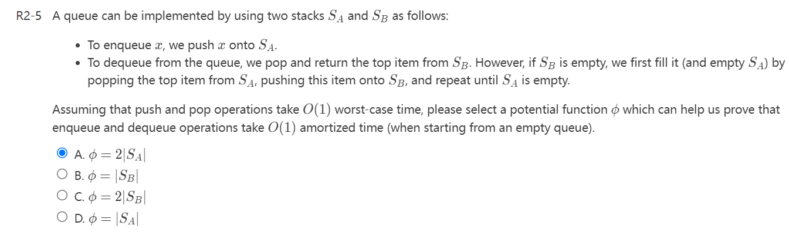

- In general, a good potential function should always assume its **minimum** at the start of the sequence.

### 5.2 Splay Tree均摊分析

 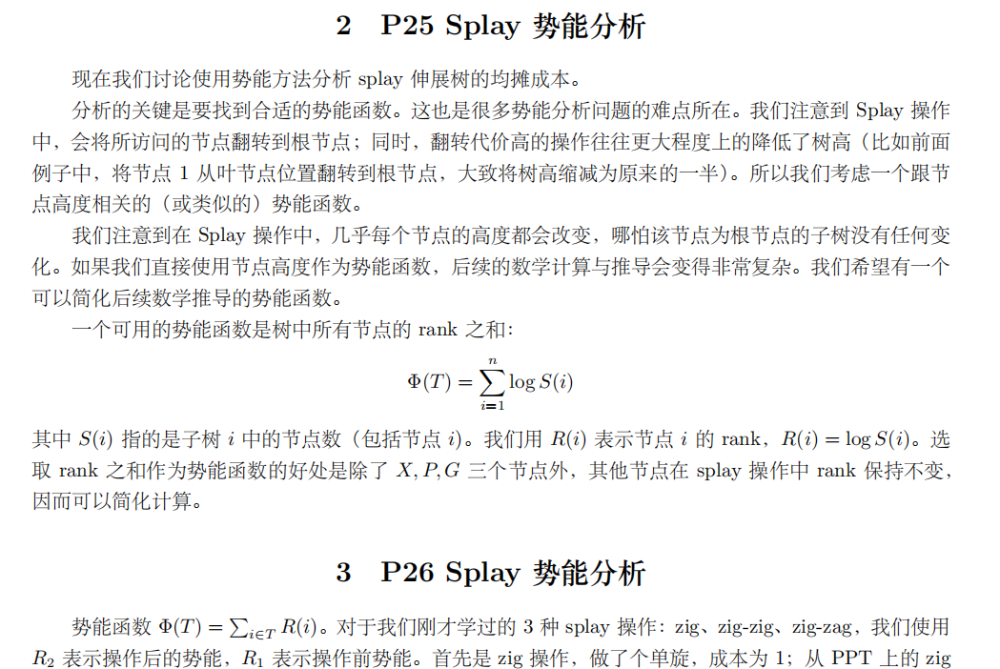

 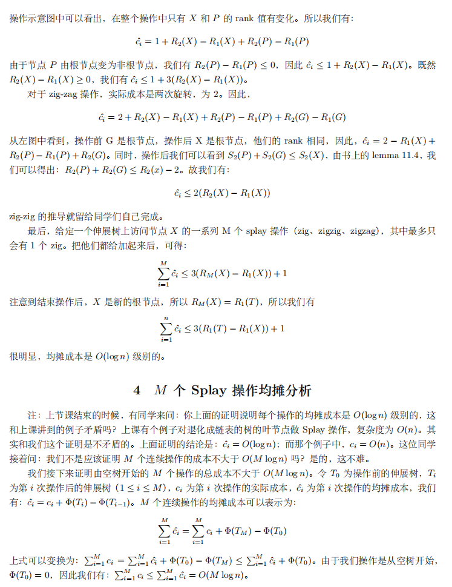

### 5.3 Skew Heap均摊分析

 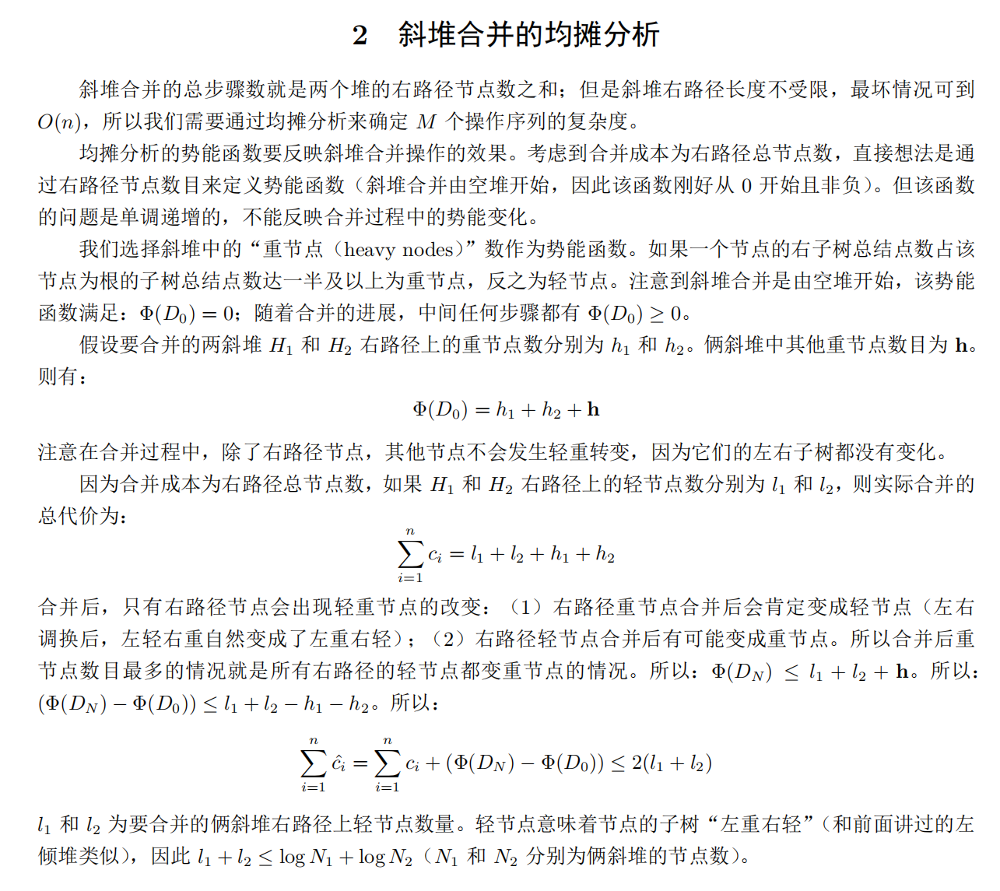

### 5.4 均摊分析例题

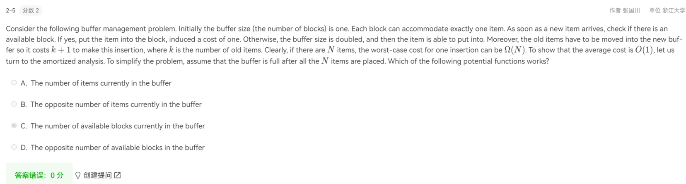 

D？切入点：最开始的势能最小、贵的操作势能差是负的。

## 6 部分作业题和历年题纠错与心得

首先，做完一定要检查一遍，先不检查别的，就检查max和min、TRUE和FALSE、black和red、possible和impossible等等词有没有看反，感觉不少都是因为这个错的。

程序填空记得再看看ppt源代码防止和老师的定义什么的不一样。

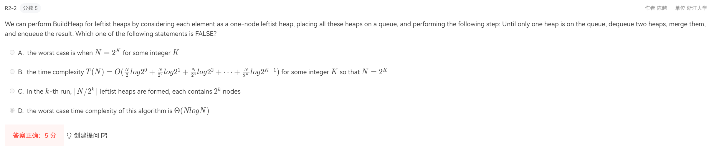 

感觉这道题的意思就是一个run是处理了一轮node而不是一次merge，然后根据C的式子可以得出是$O(N)$的。

## 后半学期部分梳理

*参考资料：毛宇尘老师智云、ads课程组ppt、Isshiki修's notebook*

后半学期的内容集中在算法分析方面，主要分为以下部分：

1. Greedy Algorithm
2. NP
3. Approximation
4. Local Search
5. Randomized Algorithms
6. Parallel
7. External Sorting

在比较难算法的部分，我们主要分成基本思想/模板和典型例题两大块梳理，考试的时候面对很新的题除了从定义/模板出发、用例题拟合之外好像也没有什么比较好的办法。

## 0 备考建议

### 复习流程

1. 结合笔记+ppt（不要漏细节，弄清楚名词含义，比如*full tree是**满**还是完全*）+每章作业（弄清所有选项）过一遍内容；
2. 刷历年卷（关注新题型）。

### 知识点

- 红黑树：操作比较复杂，建议死记硬背（否则会推出不同版本的操作），每一步检查基本定义。

- AVL：关注实现，需要会写代码。
- 摊还分析：考虑特殊情况，树退化成链情况下复杂度，对/2敏感，树高/2很可能结果带log，手动模拟特殊情况；注意势能符号方向。
- DP：注意模型，设计状态要考虑的：是否是对当前状态最优的总结，是否能转移到下一个状态；可能会考编程。
- 贪心：选择题考虑特殊值，适当放弃。注意模型，可能会考编程。
- 分治：主定理，注意适用范围；如果拿不准直接画树求解，对数学推理要求高，注意不平衡的情况。
- 并行和外部排序：难度不高，建议搞明白拿到分数。
- 剩下的部分难起来会很难，搞明白基本定义和典型例题即可，适当放弃，不建议死磕。

### 考试策略

- 预分配时间，先做自己擅长的，千万不能先做编程题，会做的不要急；没有把握的、看不懂的、没有思路的、麻烦的合理跳最后做。
- 程序填空观察没有用到的变化，编程题适当采取骗分策略（例如DP用贪心解大部分case）。

## 1 Greedy Algorithm

### 1.1 基本思想

定义就是在每一个状态下选择当下的最优解并且不再在之后的算法过程中改变。

由定义，我们不难得出：贪心算法有效的条件为$OPT_{local}=OPT_{global}$，而在不满足条件的时候，由当前最优解组成的解也会相对接近全局最优解。

所以我们在这个问题下要讨论的是以下几个子问题：

1. 每一步之下的$OPT_{local}$是什么（在这里需要保证$OPT$有解）
2. 为什么/如何证明得到的解全局最优 - 如果有选择题选择$OPT_{local}$，可以考虑举反例

不过要注意的一点是，贪心解在有些情况下并不是唯一全局最优解，故贪心限制条件不一定适用于所有全局最优解。

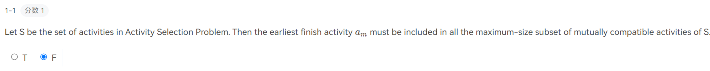 

### 1.2 基本例题

#### 1.2.1 Activity Selection

题目的目的是解出一种最多的不重合的活动集合。使用DP可解但是是$O(N^2)$的。

考虑我们在基本思想提到的两个子问题：

1. 每一步之下的$OPT_{local}$是什么（在这里需要保证$OPT$有解）

earliest finish time

2. 为什么/如何证明得到的解全局最优

在这里我们采取反证法的方式，即假设一个不等于贪心解的最优解，然后把最优解向贪心解拟合/转换，找到矛盾（可能是最优解多出来的元素，或者说“更优的那部分”，和贪心算法或是其他限制条件冲突），即可证明不存在比贪心解更优的解，那么贪心解就是全局最优。

```cpp
// 我觉得我写得好意识流，应该不是我的问题，是ads的问题（确信
```

时间复杂度 - 排序+scan选（online） - $O(N\log{N})$

- 在这里我们还衍生出了一个问题，当每个活动都带不一样的权重的时候，贪心解还有效吗？答案是否定的，我们可以举反例证明。那么这个时候就不得不使用DP了。算法如下：

   

#### 1.2.2 Huffman Coding

**问题引入**

在这个问题，我们先引入了一个概念：prefix (free) code - 在这个编码方式下任意一个元素不为另一个元素的前缀。

那么在多种编码方式中，也就引进了求**以频率为权的加权平均下最小编码长度**（以及对应编码方式）问题。

**问题转化**

对于这个问题，首先我们把编码转换成建二叉树，左孩子标`0`右孩子标`1`，容易得到取所有叶子节点的编码是一个prefix free code。由此我们将编码问题转换成了找树的问题。

**两个贪心子问题**

1. 每一步之下的$OPT_{local}$是什么（在这里需要保证$OPT$有解）

采用bottom-up方式自底向上构建树，每次取两个频率最小的子树/node合并为新子树并将新子树的频率设为两个旧子树的频率和。循环直到合并成一个树。

时间复杂度 - 一次减少一个node，$O(C\log{C})$

2. 为什么/如何证明得到的解全局最优

首先我们通过之前提到的exchange到贪心解+反证的方法证明在一个opt的tree中频率最小的两个node一定是siblings，然后通过不断把$T$中两个频率最低的node看成合并的一个node的$T'$的方式，采用前面的LEMMA证明$T'$的opt可推$T$的opt，进而使用数学归纳法证明Huffman算法的全局最优。

#### 1.2.3 Prim's Algorithm

证明的定理是任意割边集的最小边一定在MST内。也是采用反证法+尝试exchange到贪心解得矛盾。

### 1.3 做题思路

主要考点在1.2的前两个模型和贪心的适用范围证明。基本思路也是从假设非贪心opt并且尝试替换为贪心解的反证法入手的。

## 2 NP Completeness

```cpp
// 这个章节比较有难度，难起来真的不知所云，我们还是就梳理比较基本的概念以及它们之间的关系，感觉考试大多数也就考基本概念和基本关系。
```

从计算复杂度层面，问题根据是否可解可以分成以下两类：

- **incomputable / undecidable** - 不可解问题，严格来说就是我们没有办法设计一个算法解决这个问题。比较典型的例子有Halting problem。
- **computable**  - 可解问题。我们可以设计算法解出的问题。其中根据复杂度又可以细分为P、NP、EXP、PSPACE、CO-NP、RP等问题，要注意这些分类不是严格正交的。
  - **P** - 多项式时间可解
  - **NP** - 多项式时间可以验证，比如SAT problem、哈密顿环问题
    - 如果问题属于NP类，那么存在一个**非确定性图灵机**，可以在多项式时间内解决这个问题。不过并不是所有的语言都可以由非确定性图灵机决定，存在一些语言属于不可计算语言，即它们不能被任何类型的图灵机（无论是确定性的还是非确定性的）决定。
  - **CO-NP** - 多项式时间可以验证答案是否定的

不难得出，P是NP的子集（也是CO-NP的子集），但是是否为真子集或者两个集合是否相等，暂时是没有被证明或者证伪的。然而考虑到这个问题，我们其中一个思路就是去找到NP中最复杂的问题比较，看看是不是P的。那么这就涉及到问题之间的难度比较，我们采取**归约（reduction）**的方式。

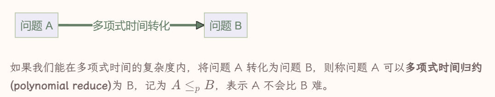 

在这里有两个例子：

1. **HCP**(Hamilton Cycle Problem)可以通过“给已有边权重赋`1`，没有的边权重赋`2`扩展为完全图”的方式归约到**TSP**(Travelling Salesman Problem) - 如果TSP有小于等于$|V|$的解则HCP有解。
2. **Clique Problem**可以通过“构造点集一样、边集互补的图$G'$”的方式，归约到**Vertex Cover Problem**（所有边必至少有一个端点在集合内），这里我感觉构造$G'$的过程是可逆的且两者是互推的所以二者可以互相归约（存疑），基于的定理为：C is a clique in G if and only if V - C is a vertex cover in G'。证明可采取反证法（正推逆推都要证明并且都可以证明）。

在定义归约之后，我们可以给出**NP-C**的定义：X是NP-C的if

- X是NP的
- 任意NP的问题都可以归约到X

第一个NP-C的问题是circuit-SAT problem。

由此我们可以给出

- 一个引理：一个NP-C的问题如果可以归约到一个NP的问题X，那么X也是NPC的。
- 一个LEMMA：如果一个NP-C的问题被证明是P的，那么P=NP。
- 这几个复杂度的关系：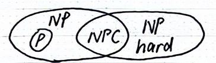 **NP-H**：至少和NP-C一样复杂

## 3 Approximation

### 3.1 基本思想

这块的核心思想就是我们把追求opt的要求松弛成了追求近似解，对于一些获取opt复杂度过高的情况。

而我们为了衡量这个近似程度的好坏，引入了近似比这个概念：

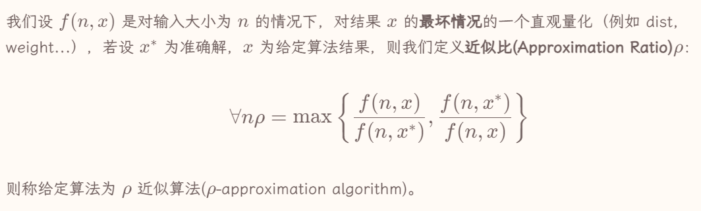 

而我们定义对于一个$(1+\epsilon)$ - approximation的算法，根据其复杂度（对任意$\epsilon$都满足）有以下分类：

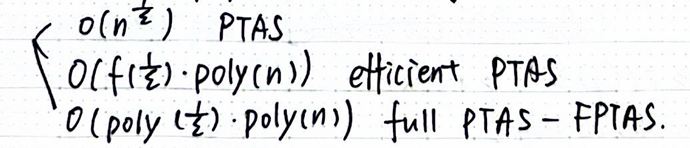 

### 3.2 基本例题

```cpp
// 这块证明太复杂而且考虑到考试是选择题，我就囫囵吞枣直接记结论了、、（真来不及了.jpg）
```

#### 3.2.1 Bin Packing

这个问题本身是NP-Hard的，所以我们要采取一些近似算法。

1. next fit - 顺序存放，放不下就放下一个箱子 - 2-approximation（bound is tight）

   *一个 tight 的近似比只能说明你对这种算法的分析到位了，而不能说明这个问题没有更好的算法*

2. any fit

   - first fit - 找第一个可以装的装 - 1.7approximation（bound is tight）
   - best fit - 找最满的装 - 1.7approximation（bound is tight）
   - worst fit - 找最空的装

3. fit+sort

   - first fit decreasing - sort + first fit

   - best fit decreasing - sort + best fit

     近似比：

     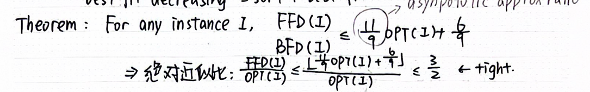 

对于这个问题的近似比有以下结论：除非P=NP，否则online的算法近似比上限是$\frac{5}{3}$，offline则是$\frac{3}{2}$。

#### 3.2 Knapsack Problem

已知使用DP我们可以得到一个伪多项式$O(N^2*v_{max})$的算法，对于item数量只能是整数的情况是NP-Hard的。那么我们如何在多项式时间内做近似？

- A1 - greedy on $\frac{v_i}{w_i}$

- A2 - greedy on $v_{i}$

显然这两者都不是很好的算法，但是我们可以结合一下：

把两个算法都跑一遍，取更优的那个，可以证明这个是2-approximation的，证明略过了，来不及了。

#### 3.3 K-center Problem

这个问题是要选取k个中心站点使得**n个站点到离各自最近的中心的距离最大值**最小。

直接上算法吧：

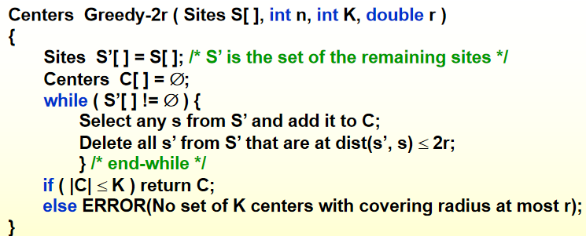 

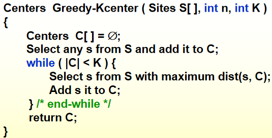 

这里有几个概念：

- r - 这个算法的目标值
- 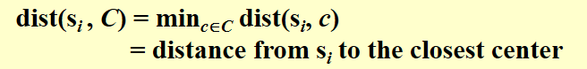 

这个算法是2-approximation的，如果P=NP那么bound tight。

## 4 Local Search

```cpp
// 时间匆忙，只顺概念了
```

### 4.1 基本概念

核心思想是在解空间选一个解，如果这个解有一个更好的neighbor就选这个neighbor，以此循环。

那么这个问题就是如何找neighbor。

### 4.2 基本例题

#### 4.2.1 Vertex Cover Problem

找最小的vertex cover，neighbor就是找一个可以通过单独加一个或者减一个点得到的解。随机取一个原解neighbor，如果点个数比原解少，直接替换，如果大于等于原解，实施“退火”概率（和点数差成反比的）替换。如果不替换则循环结束。

#### 4.2.2 Hopfield Network Problem

good edge - $W_{e}S_{u}S_{v} ＜ 0$，否则为bad edge。

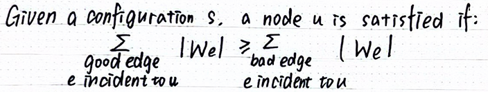 可以通过flip unsatisfied的node得到全局最优 - 最大好边权重和

#### 4.2.3 Maximum Cut

是NP-Hard的，可以通过local search找2-approximation解，目的是割边权和最大。

算法就是flip node u的归属如果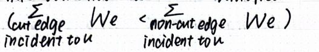

## 5 Randomized Algorithms

概念没什么好说的，如标题。

### 5.1 基本例题

#### 5.1.1 Hiring Problem

要求是招到最好的candidate的前提下尽可能减少招的candidates数量，直接scan最坏情况下是n个，先打乱一遍再scan就是$O(\log{N})$的期望个数。

如果把问题改成只招一个，要提高招到最好那个的概率$p$，我们就先随机打乱，再scan前k个找到前k个最高分x，往后scan发现比x还高分的就hire这个。可以通过概率论知识计算得到$k = \frac{n}{e}$时$p$取max = $\frac{1}{e}$。

那么在这里还涉及到一个问题就是我们怎么打乱，这里给出了两种方式：

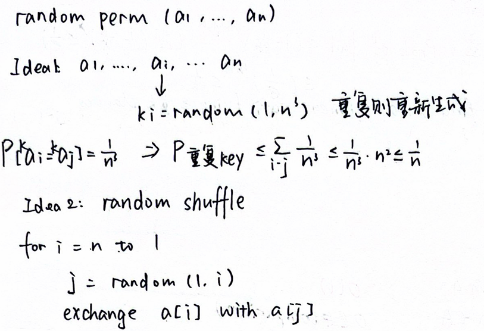 

#### 5.1.2 3-SAT

3个变量取或的k个表达式取与。

采用一半概率T一半概率F的方式给每个变量赋值，期望是$\frac{7}{8}$的表达式符合，而我们需要随机$8k$次这样可以达到大于期望的为T的表达式数量。

这个课程组ppt没有，不细究了。

#### 5.1.3 QuickSort

如果数据规模小我们可以直接排，但是数据规模太大就要找pivot然后分割问题（小于p和大于p的分别qsort）。

但是我们需要找一个还不错的pivot，保证可以把问题分割得比较好。我们这样定义好的pivot：

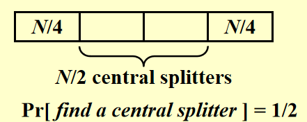 

至于选取，我们就random pick，不满足再重新pick，复杂度的期望是$O(N)$，总复杂度期望是$O(N\log{N})$ - 树高最多$O(\log_{\frac{4}{3}}{N})$层

但是其实不选好pivot直接排的期望也是$O(N\log{N})$，可能方差更大一点。

## 6 Parallel

```cpp
// 学长说后面这两块还算简单，好好复习一下
```

硬件层面，PRAM是由很多个处理器和共享的一个内存构成的，也就有了对应的不同的读写策略：

- CREW - 同时读不同时写
- EREW - 不支持同时读或写
- CRCW - 都可以同时读/写，这后面包含了很多处理并行的规则

而对于几个并行的处理器，我们就考虑了一些并行的算法，引入两个变量：

- $W$ - 不考虑并行情况下这个算法总工作量
- $D$ - 并行算法下最长的一条的工作量（树高） - 衡量了并行程度

*注：一般情况（题目没有特别说明）下，我们默认又无限多个处理器，这个时候parallel算法的时间复杂度就等同于D*

而对于两个算法，如果两个算法是串行的，那么$W = W_1 + W_2$且$D = D_1 + D_2$；

如果是并行的，那么$W = W_1 + W_2$且$D = max(D_1, D_2)$。

对于处理器数量为$P$的情况，我们（时间紧迫不加证明地）给出了执行时间复杂度的上下界：

$max(D, \frac{W}{P}) ≤ T_P(N) ≤ \frac{W}{P}+D$

看几个例子吧：

### 6.1 Summation

简单来说就是建个树自底向上两两求和，同层并行。

注意一下：

1. 这个树的图和对应下标，最底层是$B(0,x)$，返回值是$B(\log_2{N},1)$
2. 计算方式是$B(h,i) = B(h - 1, 2i-1) + B(h - 1, 2i)$，考场上搞不清楚可以代个特殊值

 

$W=O(N), D=O(\log{N})$

### 6.2 Prefix Sum

目的是求一个序列的N个前缀和。

考虑两种基本思路：

1. 串行扫描，$W = O(N), D = O(N)$
2. 从1到N建N个6.1的求和树并行计算，$W = O(N^2), D = O(\log{N})$

这两个情况要么$W$很大，要么$D$很大，我们怎么优化呢？

引入一个节点的$C(h,i)$这个定义 - 即$A(1)$到这个节点为根的子树最右边的叶子节点的和。

我们先和6.1一样自底向上算好所有的$B$，不难得出整棵树的根节点$C$和$B$是相等的，我们可以根据以下关系自顶向下计算：

- 一个节点的左孩子$C(h,i) = C(h+1,\frac{i-1}{2}) + B(h,i)$
- 一个节点的右孩子$C(h,i) = C(h+1, \frac{i}{2})$

最后我们返回的是$C(0,1到N)$

$BC$串行，根据之前的定理$W = O(N), D= O(\log{N})$

### 6.3 Parallel Merge Sort

在归并排序中我们性能的瓶颈在于merge：

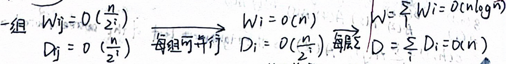 

现在有一个什么算法可以把$D$降到$O({\log{N}}^2)$。

我们考虑对Merge的优化，这里引入了rank的概念，先计算所有rank再merge：

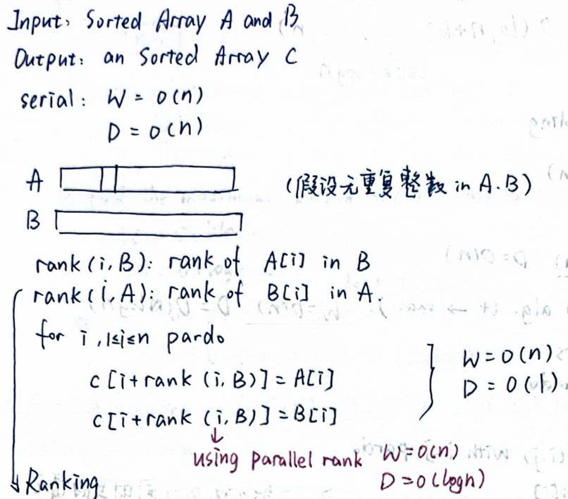 

对于并行计算每一个rank，也有三种方式：

1. 两个指针分别在A和B上，顺序扫描：

   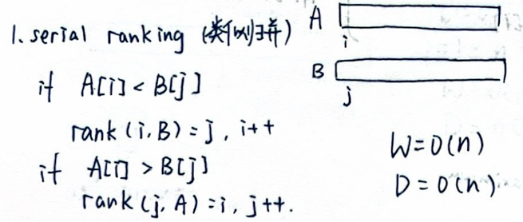 

2. 对每一个元素二分查找：

   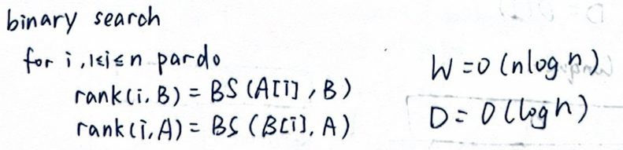 

3. parallel ranking

   首先对A和B每隔k取一个元素，对这些元素并行采用二分查找（方式2）算出rank并按照rank的位置分组，可以通过反证法证明两线不会交叉，那么每组最多2k个元素：

   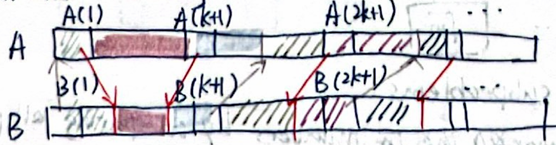 

   $W_1 = O(\frac{2N}{k}\log{N}), D_1 = O(\log{N})$

   对每一个组并行地采用方式1串行扫描，$W_2 = O(N), D_2 = O(k)$

   因为步骤1和2串行，可得复杂度：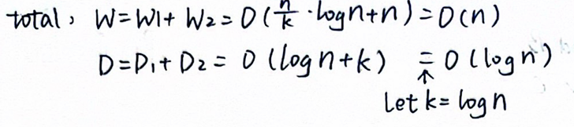

### 6.4 Maximum Finding

有很多种方法实现：

0. 串行扫描，$W = O(N), D = O(N)$

1. 和summation一样自底向上建树，记录的值变成孩子的max，$W = O(N), D = O(\log{N})$

2. 并行地比较所有的pair，把每个pair里面较小值标成`1`，并行访问所有元素，取出唯一一个没有标成`1`的，$W = O(N^2), D = O(1)$

3. 基于pair比较的分治法，即分成$\sqrt{N}$块，每块并行地跑2，复杂度：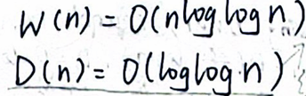

4. 结合方法1和方法3，分成$k$块，先对每一块并行地串行扫描，扫出$k$个最大值，再对这$k$个值采用方法3。复杂度：

   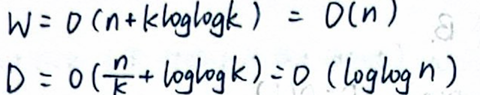 let $k = \frac{N}{\log{\log{N}}}$

5. Random Sampling

   概括来讲就是把A通过random sample算法变成一个$N^{\frac{7}{8}}$规模的B：

   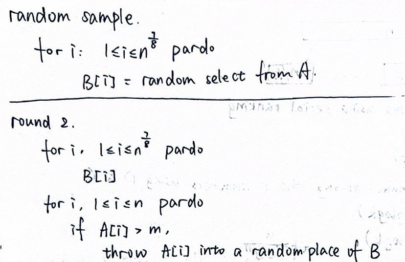 

   然后不停地巧妙分治找到B的max：

   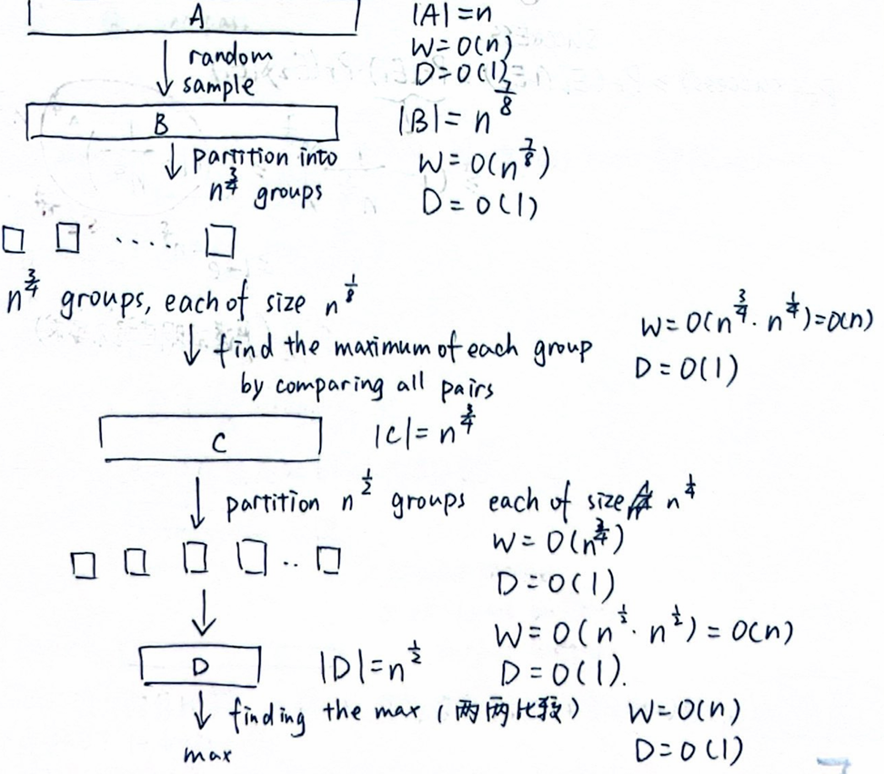 

   最后的复杂度和概率：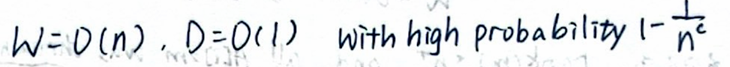

## 7 External Sorting

````cpp
// 时间紧迫，不再理了，学长说这个也要好好复习，相对简单
````

这章可以看[Isshiki修's notebook](https://note.isshikih.top/cour_note/D2CX_AdvancedDataStructure/Lec15/)的

考后补坑：这块修佬的笔记确实很足够了，时间来不及也可以面向历年卷复习，主要考点是：多个tape怎么merge的、怎么计算多少次pass，replacement到底如何执行的。