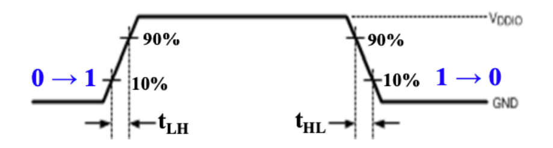

# 数字逻辑设计期末复习

时序电路部分：[时序电路整理](assets/时序电路.pdf) 
## chapter1

### 进制转换

- 整数的转换
    - Binary - 二进制
    - Octal - 八进制
    - Decimal - 十进制
    - Hexadecimal - 十六进制
    - 一般在其他进制转换的过程中都是以二进制为桥梁的

- 小数的转换
    - DtoB - 乘2进1法
    - BtoOther - 从小数点开始从左到右取n位转换
    - 由于小数部分不存在“最小精度”的说法，所以有可能十进制无法精准转化为二进制，但是二进制可以转化为十进制

### 二进制与编码的转换

- BCD码 - 4位二进制表示1位十进制
    - 运算过程中的进位（补6）问题 - 8 + 5 = 1000 + 0101 = 1101 补6 1101 + 0110 = 1 0011，其中1作为carry
    - Excess3（余3码）- 在 BCD码的基础上，增加一个大小为 3 的偏移量
        - 方便判断进位，不过运算后还得修正：如果结果没进位，则减去 3；如果结果进位了，则加上 3
- one-hot/one-cold
- ASCII码 - 字符编码 

- Parity Bit - 奇偶校验位
    - 看清奇偶 - 加上校验位后1的个数
    - 看清最高位校验还是最低位校验

- Gray Code - 格雷码，相邻两个数在二进制表示下只差一位
    - 寻找第k个格雷码：$k$  XOR $(k>>1)$
    - “镜像技巧”：

## chapter2

### 布尔代数

- 达摩根律 - break the line, change the sign
- 分配律
    - $X + YZ = (X+Y)(X+Z)$
- **一致性定理**
    - $XY+\bar{X}Z+YZ=XY+\bar{X}Z$
    - $(X + Y)(\bar{X} + Z)(Y+Z)=(X+Y)(\bar{X}+Z)$
- the dual - 对偶性质
    - 翻转0/1和AND/OR
    - 不翻转布尔变量
    - **不改变原先优先级顺序**
    - 等式两边对偶后仍然成立

### Complement of a function 互补函数

- OR $\leftrightarrow$AND
- 0's $\leftrightarrow$1's
- $X\leftrightarrow\bar{X}$
- 一个 **函数的互补(Complement of a Function)** 指的是，将它的 **对偶函数** 中每一个 **变量** 都取反得到的函数，而该函数正好等于原函数的 **非**：
- 也可以直接取非之后使用达摩根律

### Canonical form（规范形式）

- 最小项之和(Sum of Minterms, SOM)
    - “枚举所有1的可能”
    - 
- 最大项之积(Product of Maxterms, POM)
    - “枚举所有0的可能”
    - 
- index 最小项直接转换二进制，最大项则取反转换二进制
    - 相同index的最小项和最大项是取反关系

### Standard form（标准形式）

- SOP(Sum of Products) - SOM的化简形式
- POS(Product of Sums) - POM的化简形式
- 混合表达（大于两层电路）不是标准形式

- 把标准形式expand成规范形式：
    - 最小项：补充 $1 = X + \bar X$
    - 最大项
        - 先变成积（使用分配律）
        - 补$X·\bar X$ 再使用分配律
        - 
    - *其实我觉得真值表更方便*

### 门输入代价

- Literal Cost 文字代价
    - $L$：表达式中Literal个数
    - 相等的$L$下电路复杂度不一定一样
    - 第一层次的输入引脚数

- Gate Input Cost 门电路输入代价

    - $G$：点完文字代价的基础上（一层结合之后（？）对文字的**组合**再次清点（**remaining OR gate inputs**）
        - 最后那个大项**不用点**
    - $GN$：点完门电路输入代价的基础上考虑非门输入个数
        - 注意去除可以共享的非门，两个$\bar B$算+1个$GN$

### 卡诺图优化

- 格雷码排布
- 尽可能大圈
- 避免冗余优化
- 合理使用don't cares
- 是规范形式和标准形式的桥梁
- Implicant - 蕴涵项
    - a product in SOP or a sum in POS
    - in K-map - a group containing $2^n$ squares
    - 两类蕴涵项：
        - prime implicant - 主蕴涵项
        - 极大蕴涵项
    - essential prime implicant - 基本主蕴涵项
        - 包含 只被它(基本主蕴含项)覆盖的 `1` 的主蕴含项

### 逻辑门

- NAND/NOR - universal gate 通用门
- XOR - 异或/XNOR - 同或
    - 多输入的异或/同或称为奇/偶函数
  
    - 奇偶校验：
        - 使用奇函数（异或）生成偶校验位
        - 使用偶函数（同或）生成奇校验位
        - 
  
- Buffer - 缓冲器
- 3-state buffer - 三态门
    - 使用使能信号选择输出接收哪个输入，具体到一个门就是是否接收该输入
    - 

exercise1: $F=(\bar{D+C·\bar{AB}})·(\bar{\bar{AB}·\bar{C+D}})=\bar{D}·(\bar{C}+AB)·(AB+C+D)=AB\bar{D}$

## Chapter3&5

### 工艺参数

**fan-in** - 一个逻辑门可用的输入数量

**fan-out** - 一个逻辑门输出时可驱动的标准负载数量

- 一般负载数量增加转换时间也会增加，而最大负载就是由最大转换时间下的负载数量决定的

**noise margin** -  对外界噪声的容忍能力(具体来说是不会导致行为异变的最大噪声阈值)

**cost** - 门对集成电路成本的贡献的度量 - Gate cost

**transition time** - 转换时间

- **$t_{LH}$** - rise time
- **$t_{HL}$** - fall time
- 

**propagation delay** - 传播延迟

- 注意判断hl还是lh是看传播到输出的变化
- **$t_{PHL}$** - propagation delay high-low
- **$t_{PLH}$** - propagation delay low-high
- 

- **$t_{pd}$** - 统一表示传播延迟时间，是hl和lh的average或者max

**power dissipation** - 电源输出能耗和门的能耗

**inertial delay** - 引入了 **拒绝时间(rejection time)**，只有当输入达到一定能量后，才会出发栅极输出（在这种模型下，噪音等会被过滤）

- 

calculate gate delay based on fan-out:

- $t_{pd}$ = 固定延迟 + SL（标准化负载量） * 一个标准负载带来的延迟系数

### 逻辑设计

表示逻辑的方法：

- Truth Table - 真值表
- Timing Diagram - 时序图
- *Boolean Function - 布尔函数*
- Karnaugh Maps - 卡诺图
- *Logic Circuit - 逻辑电路图*

*斜体表示 表达方式不唯一*

设计过程：specification - 确定系统的行为$\rightarrow$formulation - 逻辑表达$\rightarrow$optimization - 优化$\rightarrow$technology mapping - 工艺映射$\rightarrow$verification - 正确性验证

**Hierarchical Design** - 分层设计

- Top-Down 自顶向下 - 从需求开始，自顶向下分解功能设计
- Bottom-up 自底向上 - 根据现有的元件去组合成目标功能

**工艺映射步骤**

### 组合功能模块

**Decoder** - 译码器

- n inputs and m outputs with n ≤ m ≤ $2^n$

- 本质上是枚举最小项
- 输出太多时，考虑fan-out的限制，我们采取分层设计：

**Encoder** - 编码器

- m inputs and n outputs with n ≤ m ≤ $2^n$

- 普通编码器必须要求输入是 one-hot 的，即只允许存在一个输入为 `1`，否则无法判断得出唯一输出。
- 优先编码器（Priority Encoder）能够实现优先级函数，它不要求输入是 one-hot 的，而是总是关注有效输入中优先级最高的那一个。即比如当优先级最高的那一位是 `1` 时，其它所有优先级不如它的位置的值都是我们不关心的内容了。

**Multiplexer** - 多路选择器

- n control inputs (selection inputs), m inputs and one output with m < $2^n$
- 通常，一个$2^n-to-1$MUX的组成为：
    - 一个$n-to-2^n$译码器（MUX 利用了译码器每次只有一个输出为 `1` 的特性，从而实现选择功能）
    - $2^n*2$ AND-OR / 利用三态门代替AND-OR门（减少门输入）
        - 完全使用三态门实现4to1MUX: 
    - MUX的本质是函数的实现

**Programmable implementation technologies** - 可编程技术 

- **PROM/ROM** - read only memory
    - 不改变项的内容，只缩短相加的项数
    - 
- **PAL** - Programmable Array Logic Devices
    -  不改变项数，可以改变项的内容
    - 有⼀组可编程的ANDs和固定的ORs（OR的数量是固定的）相结合，⼀旦超过3个项的与或者或，就要利⽤中间变量进⾏迭代
    - 
- **PLA** - Programmable Logic Array
    - 项数可以改变，也可以改变项的内容
    - 前端对变量扩展、重编程，有⼀组可编程的ANDs和⼀组可编程的ORs
    - 输出端不⽌⼀次重编程，输出前的异或相当于直接输或者取反，取反可以达到增加输⼊项的⽬的 - 因此我们在设计的时候可以画卡诺图观察互补性
    - 
- **Lookup Table** - 查找表
    - 通过让数据源接内存，并通过修改真值表内的值，即修改内存里的值，来实现数据源的变化，来改变 `MUX` 的行为。
    - 
    - 而在实际工艺过程中，会利用a tree of smaller MUXes 组 成 ⼀ 个 ⼤ MUX：
- **FPGA**
    - *复习ppt上面没有提到这个考点，所以我就粗略整理了*
    - 
    - CLB(Configurable Logic Block)
        - 大量存储 `LUT`
    - SM(Switch Matrix)
        - 可编程的交换矩阵
    - IOB(Input & Output Block)
        - 可编程的输入输出单元

### 加法器

**Half Adder** - 半加器

- $S=X\bigoplus Y$
- $C=XY$

**Full Adder** - 全加器

- $S=X\bigoplus Y\bigoplus Z$
- $C=XY+(X\bigoplus Y)Z$
    - **carry generate** - $XY$，进位产生项
    - **carry propagate** - $X\bigoplus Y$，进位传播项

- 半加器和全加器的区别就是2/3输入的区别，半加器不接收之前的进位信息

**Binary Ripple Carry Adder** - 行波进位加法器

- 全加器实现的行波进位加法器的复杂度比较高，进位的传递非常漫长

**Carry Lookahead Adder (CLA)** - 超前进位加法器

- 使用GP的划分，因为GP的值都只与当下的两个XY输入相关，因此我们对进位传递的优化只需要考虑**上一个进位**的提前计算，也就是迭代解决这个问题：
- 又因为在工艺映射的过程中fan-in的限制，我们采取**Group Carry Lookahead Adder** - 模块化超前进位加法器的方式，组内提前进位，组间行波进位：

### 二进制计算

补码计算：从低位到高位扫描

- 复制所有最低有效的0
- 复制第一个出现的1
- 接下来所有位取反

对有符号数，反码和补码的计算是保留符号位（最高位）的，也就是说最高位始终为1（表示负权重）。

符号拓展：将符号位复制到更高位。

无符号二进制减法：先加上被减数的补码，如果得到的进位是1，则不用修改；否则取结果的补码并加上负号作为最终的答案。

带符号的二进制数运算：先将所有数变成带符号的二进制补码进行运算，再舍弃溢出位、转换回来。运算时减法取减数的无符号二进制补码（我的理解是化减为加）进行计算。

